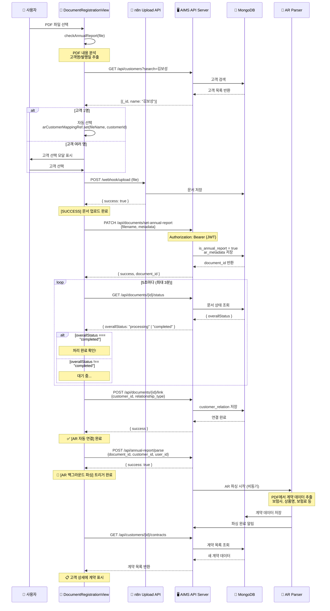
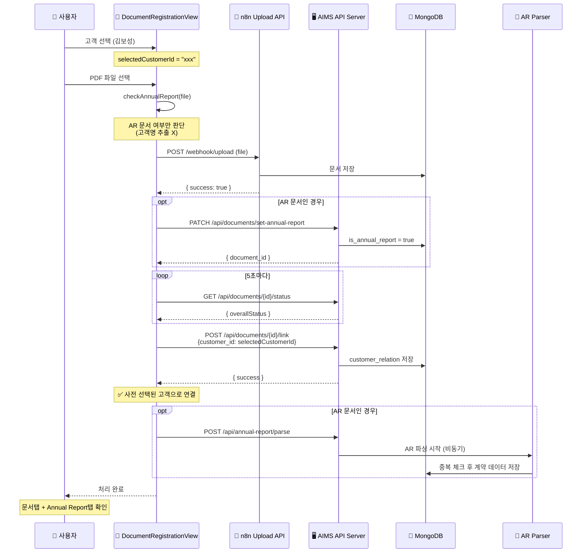

# AR 문서 처리 흐름

> 이 문서는 AR(연간안내장) 문서의 처리 흐름을 정리한 문서입니다.

---

## 목차

1. [현재 처리 흐름 (AS-IS)](#현재-처리-흐름-as-is)
2. [개선된 처리 흐름 (TO-BE)](#개선된-처리-흐름-to-be)

---

## 이전 처리 흐름 (AS-IS) - ⚠️ 더 이상 사용하지 않음

> **작성일**: 2025-11-28
> **상태**: ~~현재 운영 중~~ → **폐기됨** (2025-11-28)

### 프로세스 개요

```
파일 선택 → AR 감지 → 업로드 → AR 플래그 설정 → 처리 대기 → 고객 연결 → AR 파싱 → UI 업데이트
```

### 상세 단계

#### 1. 파일 선택 및 AR 감지
- **1.1** 사용자가 PDF 파일 선택
- **1.2** `checkAnnualReport(file)` 호출
  - **1.2.1** PDF 텍스트 추출 (pdf.js)
  - **1.2.2** "연간안내장", "보험계약 안내장" 키워드 검색
  - **1.2.3** 고객명, 발행일 추출
- **1.3** 고객 자동 매칭
  - **1.3.1** `GET /api/customers?search={고객명}` 호출
  - **1.3.2** 고객 1명 → 자동 선택
  - **1.3.3** 고객 여러 명 → 선택 모달 표시

#### 2. 파일 업로드
- **2.1** `POST /webhook/upload` (n8n) 호출
- **2.2** MongoDB GridFS에 파일 저장
- **2.3** 업로드 완료 응답 수신

#### 3. AR 플래그 설정
- **3.1** `PATCH /api/documents/set-annual-report` 호출
  - **3.1.1** `is_annual_report: true` 설정
  - **3.1.2** `ar_metadata` 저장 (고객명, 발행일)
- **3.2** `document_id` 반환

#### 4. 문서 처리 완료 대기
- **4.1** 폴링 시작 (5초 간격, 최대 3분)
- **4.2** `GET /api/documents/{id}/status` 호출
- **4.3** `overallStatus === "completed"` 확인

#### 5. 고객 자동 연결
- **5.1** `POST /api/documents/{id}/link` 호출
  - **5.1.1** `customer_id` 설정
  - **5.1.2** `relationship_type: "annual_report"` 설정
- **5.2** `customer_relation` 저장 완료

#### 6. AR 파싱 트리거
- **6.1** `POST /api/annual-report/parse` 호출
  - **6.1.1** `document_id`, `customer_id`, `user_id` 전송
- **6.2** 백그라운드 파싱 시작

#### 7. AR 파싱 (백그라운드)
- **7.1** PDF에서 계약 데이터 추출
  - **7.1.1** 보험사명
  - **7.1.2** 상품명
  - **7.1.3** 보험료
  - **7.1.4** 계약일/만기일
- **7.2** 계약 데이터 MongoDB 저장

#### 8. UI 업데이트
- **8.1** 고객 상세 → 연간보고서 탭에서 확인
- **8.2** `GET /api/customers/{id}/contracts` → 계약 목록 표시

### 시퀀스 다이어그램



### 주요 API 요약

| 단계 | API | 설명 |
|------|-----|------|
| 1 | `checkAnnualReport()` | 파일 선택 및 AR 감지 |
| 2 | `POST /webhook/upload` | 파일 업로드 |
| 3 | `PATCH /api/documents/set-annual-report` | AR 플래그 설정 |
| 4 | `GET /api/documents/{id}/status` | 처리 완료 대기 |
| 5 | `POST /api/documents/{id}/link` | 고객 자동 연결 |
| 6 | `POST /api/annual-report/parse` | 백그라운드 파싱 트리거 |
| 7 | (비동기) | AR 파싱 진행 |
| 8 | `GET /api/customers/{id}/contracts` | UI 업데이트 |

### 관련 파일

| 파일 | 역할 |
|------|------|
| `DocumentRegistrationView.tsx` | AR 감지, 업로드, 플래그 설정, 폴링 |
| `AnnualReportTab.tsx` | AR 파싱 결과 표시 |
| `server.js` | API 엔드포인트 처리 |

### 현재 흐름의 특징

- **프론트엔드 주도**: 모든 흐름이 프론트엔드에서 제어됨
- **폴링 기반**: 처리 완료 확인을 위해 5초 간격 폴링 사용
- **순차적 처리**: 업로드 → 플래그 설정 → 대기 → 연결 → 파싱 순서로 진행

---

## 개선된 처리 흐름 (TO-BE) - ✅ 현재 운영 중

> **작성일**: 2025-11-28
> **상태**: ~~설계 완료~~ → **구현 완료 및 배포** (2025-11-28)

### 핵심 변경 사항

**AS-IS**: AR문서에서 고객명 추출 → 고객 검색/생성/선택 → 자동연결
**TO-BE**: 사전 선택된 고객 → 자동연결 (일반 문서와 동일)

### 설계 원칙

- 문서등록 시작 시점에 고객이 **미리 선택**되어 있음
- AR문서가 **누구의 AR문서인지 따지지 않음**
- 모든 업로드 문서는 **사전 선택된 고객**에게 연결됨

### 예시 시나리오

```
문서등록 시 "김보성" 고객 선택된 상태에서
김보성, 안영미, 신상철, 정부균의 AR문서 4개 업로드

→ 4개 AR문서 모두 "김보성" 고객에게 자동연결
→ 김보성 고객 상세 > 문서탭에서 4개 문서 확인 가능
→ 4개 문서 각각 AR파싱 진행
→ Annual Report 탭에 파싱 결과 등록
→ 동일 발행일 중복 등록 방지
```

### 일반 문서 vs AR 문서 비교

#### 공통 흐름 (95%)

```
고객선택 → 업로드 → 처리대기 → 자동연결
```

| 단계 | 설명 |
|------|------|
| 1 | 문서등록 시작 전 **고객 선택** (사전 지정) |
| 2 | 파일 선택 |
| 3 | `POST /webhook/upload` 업로드 |
| 4 | 문서 처리 완료 대기 (폴링) |
| 5 | **사전 지정된 고객**으로 자동 연결 |

#### AR 문서만 다른 부분 (5%)

```
일반 문서:  ... → 자동연결 → 끝
AR 문서:   ... → 자동연결 → AR파싱 → 끝
                              ↑
                         유일한 차이점
```

| 항목 | AR 문서 | 일반 문서 |
|------|---------|----------|
| AR 감지 | `is_annual_report: true` 플래그 설정 | 없음 |
| 자동 연결 후 | AR 파싱 트리거 | 끝 |
| 결과 저장 | Annual Report 탭에 파싱 결과 저장 | 없음 |
| 중복 체크 | 동일 고객 + 동일 발행일 → 1건만 유지 | 없음 |

### 제거되는 로직

| 기존 로직 | 설명 |
|----------|------|
| `checkAnnualReport()`의 고객명 추출 | PDF에서 고객명 파싱 불필요 |
| 고객 검색 API 호출 | 이미 선택되어 있으므로 불필요 |
| 동명이인 선택 모달 | 선택 과정 자체가 없음 |
| `arCustomerMappingRef` 관리 | 파일별 고객 매핑 불필요 |

### 유지되는 로직

| 로직 | 설명 |
|------|------|
| AR 문서 감지 | 키워드 기반 (`연간안내장`, `보험계약 안내장`) |
| `is_annual_report` 플래그 설정 | AR 문서 식별용 |
| AR 파싱 트리거 | 자동연결 후 파싱 시작 |
| 중복 등록 방지 | 동일 고객 + 동일 발행일 체크 |

### 상세 단계

#### 1. 고객 선택 (문서등록 시작 전)
- **1.1** 문서등록 페이지에서 고객 선택
- **1.2** 선택된 고객 ID가 세션에 저장됨

#### 2. 파일 선택 및 AR 감지
- **2.1** 사용자가 PDF 파일 선택
- **2.2** `checkAnnualReport(file)` 호출
  - **2.2.1** PDF 텍스트 추출 (pdf.js)
  - **2.2.2** "연간안내장", "보험계약 안내장" 키워드 검색
  - **2.2.3** AR 문서 여부만 판단 (고객명 추출 제거)

#### 3. 파일 업로드
- **3.1** `POST /webhook/upload` (n8n) 호출
- **3.2** MongoDB GridFS에 파일 저장
- **3.3** 업로드 완료 응답 수신

#### 4. AR 플래그 설정 (AR 문서인 경우)
- **4.1** `PATCH /api/documents/set-annual-report` 호출
  - **4.1.1** `is_annual_report: true` 설정
- **4.2** `document_id` 반환

#### 5. 문서 처리 완료 대기
- **5.1** 폴링 시작 (5초 간격, 최대 3분)
- **5.2** `GET /api/documents/{id}/status` 호출
- **5.3** `overallStatus === "completed"` 확인

#### 6. 고객 자동 연결
- **6.1** `POST /api/documents/{id}/link` 호출
  - **6.1.1** **사전 선택된 고객 ID** 사용
  - **6.1.2** `relationship_type` 설정
- **6.2** `customer_relation` 저장 완료

#### 7. AR 파싱 트리거 (AR 문서인 경우)
- **7.1** `POST /api/annual-report/parse` 호출
  - **7.1.1** `document_id`, `customer_id`, `user_id` 전송
- **7.2** 백그라운드 파싱 시작

#### 8. AR 파싱 (백그라운드)
- **8.1** PDF에서 계약 데이터 추출
- **8.2** 중복 체크 (동일 고객 + 동일 발행일)
- **8.3** 계약 데이터 MongoDB 저장

#### 9. UI 업데이트
- **9.1** 고객 상세 → 문서 탭에서 확인
- **9.2** 고객 상세 → Annual Report 탭에서 파싱 결과 확인

### 시퀀스 다이어그램



### 장점

| 항목 | 설명 |
|------|------|
| **단순화** | AR 전용 복잡한 로직 제거 |
| **일관성** | 일반 문서와 동일한 흐름 |
| **유지보수** | 코드 복잡도 대폭 감소 |
| **유연성** | 한 고객에게 여러 명의 AR문서 등록 가능 |

---

## 구현 완료 내역

### 제거된 코드

| 파일 | 제거된 내용 |
|------|-------------|
| `pdfParser.ts` | 고객명 추출 로직 (`customer_name` 필드) |
| `DocumentRegistrationView.tsx` | `arQueueRef`, `processNextArInQueue()` |
| `DocumentRegistrationView.tsx` | `handleCustomerSelected()`, `handleCustomerModalClose()` |
| `DocumentRegistrationView.tsx` | 모달 상태 변수 (`isCustomerModalOpen`, `annualReportMetadata` 등) |
| `CustomerIdentificationModal/` | 전체 컴포넌트 디렉토리 삭제 |

### 수정된 코드

| 파일 | 변경 내용 |
|------|-----------|
| `pdfParser.ts` | `CheckAnnualReportResult` 타입에서 `customer_name` 제거 |
| `DocumentRegistrationView.tsx` | AR 처리 시 사전 선택된 고객(`customerFileCustomer`) 사용 |
| `DocumentRegistrationView.tsx` | `arMetadataMappingRef` 타입에서 `customer_name` 제거 |

### 검증 결과

- **TypeScript 빌드**: ✅ 성공
- **단위 테스트**: ✅ 2962개 통과 (126 파일)

---

## 변경 이력

| 날짜 | 내용 |
|------|------|
| 2025-11-28 | 현재 처리 흐름 (AS-IS) 문서화 |
| 2025-11-28 | 개선된 처리 흐름 (TO-BE) 설계 완료 |
| 2025-11-28 | **TO-BE 구현 완료** - 고객 검색/모달 제거, 사전 선택된 고객 사용 |
