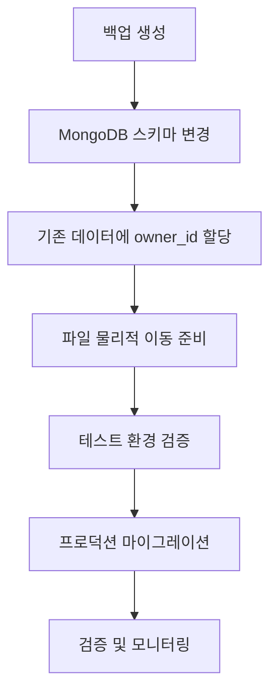

# AIMS 사용자 계정 기능 도입 마이그레이션 계획

**작성일**: 2025-10-30
**목표**: 테스트 계정(tester)으로 시작하는 사용자별 문서/고객 관리 시스템 구축

---

## 📋 목차

1. [현재 상태 분석](#1-현재-상태-분석)
2. [목표 아키텍처](#2-목표-아키텍처)
3. [마이그레이션 단계](#3-마이그레이션-단계)
4. [백엔드 수정 계획](#4-백엔드-수정-계획)
5. [프론트엔드 수정 계획](#5-프론트엔드-수정-계획)
6. [데이터 마이그레이션](#6-데이터-마이그레이션)
7. [테스트 시나리오](#7-테스트-시나리오)
8. [롤백 계획](#8-롤백-계획)

---

## 1. 현재 상태 분석

### 1.1 문제점

| 영역 | 현재 상태 | 문제점 |
|------|-----------|--------|
| **인증** | ❌ 없음 | 누구나 API 접근 가능 |
| **사용자 구분** | ❌ 없음 | 모든 데이터가 공용 |
| **파일 경로** | `/data/files/2025/10/` | 사용자별 격리 불가 |
| **DB 스키마** | `owner_id` 없음 | 소유권 관리 불가 |
| **프론트엔드** | 하드코딩 `rossi.kwak@gmail.com` | 동적 사용자 전환 불가 |

### 1.2 핵심 파일 위치

**백엔드**:
- Node.js API: `backend/api/aims_api/server.js`
- Python 문서 상태 API: `backend/api/doc_status_api/main.py`
- Python AR API: `backend/api/annual_report_api/main.py`
- Python RAG API: `backend/api/aims_rag_api/main.py`

**프론트엔드**:
- API 클라이언트: `frontend/aims-uix3/src/shared/lib/api.ts`
- 사용자 컨텍스트: `frontend/aims-uix3/src/components/DocumentViews/DocumentRegistrationView/services/userContextService.ts`
- 업로드 서비스: `frontend/aims-uix3/src/components/DocumentViews/DocumentRegistrationView/services/uploadService.ts`

---

## 2. 목표 아키텍처

### 2.1 파일 경로 구조 변경

```
변경 전:
/data/files/2025/10/251025053301_voninb1n.pdf

변경 후:
/data/files/users/tester/2025/10/251025053301_voninb1n.pdf
```

### 2.2 MongoDB 스키마 변경

**files 컬렉션**:
```javascript
{
  _id: ObjectId("..."),
  owner_id: "tester",  // 신규 필드
  upload: {
    destPath: "/data/files/users/tester/2025/10/file.pdf"  // 경로 변경
  }
}
```

**customers 컬렉션**:
```javascript
{
  _id: ObjectId("..."),
  meta: {
    created_by: "tester",  // 신규 필드
  }
}
```

### 2.3 API 요청 흐름

```
프론트엔드 → API 요청 (userId: "tester" 포함)
              ↓
         백엔드 검증
              ↓
      userId 기반 필터링
              ↓
         응답 반환
```

---

## 3. 마이그레이션 단계

### Phase 1: 백엔드 기반 작업 (1주)

1. **MongoDB 스키마 변경**
   - `files.owner_id` 필드 추가
   - `customers.meta.created_by` 필드 추가
   - 인덱스 생성

2. **기존 데이터 마이그레이션**
   - 모든 기존 데이터에 `owner_id: "tester"` 할당
   - 파일 물리적 이동 스크립트 작성 및 실행

3. **백엔드 API 수정**
   - 요청 body/query에서 `userId` 추출
   - DB 쿼리에 `owner_id` 필터 추가
   - 파일 저장 경로에 `userId` 포함

### Phase 2: 백엔드 검증 (3일)

4. **API 단위 테스트**
   - 문서 CRUD (userId 필터링 확인)
   - 고객 CRUD (userId 필터링 확인)
   - 파일 업로드 (경로 확인)

5. **수동 테스트**
   - curl/Postman으로 API 호출
   - 다른 userId로 접근 시 차단 확인

### Phase 3: 프론트엔드 작업 (3일)

6. **전역 사용자 Store 생성**
   - `useUserStore.ts` 구현
   - localStorage 연동

7. **UserContextService 동적화**
   - 하드코딩 제거
   - Zustand store 연동

8. **API 호출 수정**
   - 모든 API 요청에 `userId` 포함
   - 하드코딩된 URL 통일

### Phase 4: 통합 테스트 (2일)

9. **E2E 테스트**
   - 파일 업로드 → 저장 경로 확인
   - 문서 조회 → userId 필터링 확인
   - 고객 관리 → userId 필터링 확인

10. **배포 준비**
    - 롤백 스크립트 준비
    - 모니터링 설정

**총 예상 기간**: 2주

---

## 4. 백엔드 수정 계획

### 4.1 MongoDB 마이그레이션 스크립트

**파일**: `backend/scripts/migrate_add_owner_id.js`

```javascript
// 1. files 컬렉션에 owner_id 추가
db.files.updateMany(
  { owner_id: { $exists: false } },
  { $set: { owner_id: "tester" } }
);

// 2. destPath 변경
db.files.find({ owner_id: "tester" }).forEach(doc => {
  const oldPath = doc.upload.destPath;
  const newPath = oldPath.replace("/data/files/", "/data/files/users/tester/");

  db.files.updateOne(
    { _id: doc._id },
    { $set: { "upload.destPath": newPath } }
  );
});

// 3. customers 컬렉션에 created_by 추가
db.customers.updateMany(
  { "meta.created_by": { $exists: false } },
  { $set: { "meta.created_by": "tester" } }
);

// 4. 인덱스 생성
db.files.createIndex({ owner_id: 1 });
db.customers.createIndex({ "meta.created_by": 1 });

print("Migration completed!");
```

### 4.2 파일 이동 스크립트

**파일**: `backend/scripts/move_files_to_user_dirs.sh`

```bash
#!/bin/bash

USER_ID="tester"
OLD_BASE="/data/files"
NEW_BASE="/data/files/users/$USER_ID"

# 디렉토리 생성
mkdir -p "$NEW_BASE"

# 연도별 폴더 이동
for year_dir in "$OLD_BASE"/20*; do
  if [ -d "$year_dir" ]; then
    year=$(basename "$year_dir")
    echo "Moving $year..."

    # 연도 폴더 복사 (원본 유지)
    cp -r "$year_dir" "$NEW_BASE/"
  fi
done

echo "File migration completed!"
echo "Verify files in: $NEW_BASE"
echo "After verification, remove old files manually."
```

### 4.3 Node.js API 수정 (aims_api)

**파일**: `backend/api/aims_api/server.js`

**수정 위치 1: 문서 조회 (Line ~200)**
```javascript
// 변경 전
app.get('/api/documents', async (req, res) => {
  const files = await db.collection('files').find().toArray();
});

// 변경 후
app.get('/api/documents', async (req, res) => {
  const userId = req.query.userId || req.headers['x-user-id'];
  if (!userId) {
    return res.status(400).json({ error: 'userId required' });
  }

  const files = await db.collection('files')
    .find({ owner_id: userId })
    .toArray();
});
```

**수정 위치 2: 고객 조회 (Line ~500)**
```javascript
// 변경 전
app.get('/api/customers', async (req, res) => {
  const customers = await db.collection('customers').find().toArray();
});

// 변경 후
app.get('/api/customers', async (req, res) => {
  const userId = req.query.userId || req.headers['x-user-id'];
  if (!userId) {
    return res.status(400).json({ error: 'userId required' });
  }

  const customers = await db.collection('customers')
    .find({ "meta.created_by": userId })
    .toArray();
});
```

**수정 위치 3: 파일 업로드 처리 (n8n webhook에서 전달받은 후)**
```javascript
// n8n webhook에서 이미 파일 저장 후 전달받는 구조이므로
// n8n 워크플로우 자체를 수정해야 함 (별도 문서 참조)
```

### 4.4 Python 문서 상태 API 수정

**파일**: `backend/api/doc_status_api/main.py`

**수정 위치 1: 상태 조회 (Line ~50)**
```python
# 변경 전
@app.get("/status/{document_id}")
async def get_document_status(document_id: str):
    doc = await db.files.find_one({"_id": ObjectId(document_id)})

# 변경 후
@app.get("/status/{document_id}")
async def get_document_status(
    document_id: str,
    user_id: str = Header(None, alias="x-user-id")
):
    if not user_id:
        raise HTTPException(status_code=400, detail="user_id required")

    doc = await db.files.find_one({
        "_id": ObjectId(document_id),
        "owner_id": user_id
    })

    if not doc:
        raise HTTPException(status_code=404, detail="Document not found")
```

**수정 위치 2: 문서 목록 (Line ~100)**
```python
# 변경 전
@app.get("/status")
async def get_recent_documents(limit: int = 100):
    docs = await db.files.find().limit(limit).to_list(limit)

# 변경 후
@app.get("/status")
async def get_recent_documents(
    limit: int = 100,
    user_id: str = Header(None, alias="x-user-id")
):
    if not user_id:
        raise HTTPException(status_code=400, detail="user_id required")

    docs = await db.files.find({"owner_id": user_id}).limit(limit).to_list(limit)
```

### 4.5 Python Annual Report API 수정

**파일**: `backend/api/annual_report_api/routes/query.py`

**수정**: 고객 AR 조회 시 userId 검증
```python
@router.get("/customers/{customer_id}/annual-reports")
async def get_customer_annual_reports(
    customer_id: str,
    user_id: str = Header(None, alias="x-user-id")
):
    if not user_id:
        raise HTTPException(status_code=400, detail="user_id required")

    # 고객이 이 사용자 소유인지 확인
    customer = await db.customers.find_one({
        "_id": ObjectId(customer_id),
        "meta.created_by": user_id
    })

    if not customer:
        raise HTTPException(status_code=404, detail="Customer not found")

    # AR 조회 계속...
```

### 4.6 n8n 워크플로우 수정

**파일**: `backend/n8n_flows/docprep-main.json`

**수정 내용**:
1. webhook에서 `userId` 파라미터 받기
2. 파일 저장 경로에 userId 포함:
   ```
   /data/files/users/{{$json["userId"]}}/{{$now.format('YYYY')}}/{{$now.format('MM')}}/
   ```
3. MongoDB 저장 시 `owner_id: userId` 포함

**주의**: n8n은 GUI로 수정해야 하므로 스크린샷 포함된 별도 문서 작성 필요

---

## 5. 프론트엔드 수정 계획

### 5.1 전역 사용자 Store 생성

**파일**: `frontend/aims-uix3/src/shared/store/useUserStore.ts` (신규)

```typescript
import { create } from 'zustand';

interface UserInfo {
  userId: string;
  userName: string;
  email: string;
}

interface UserStore extends UserInfo {
  setUser: (user: UserInfo) => void;
  clearUser: () => void;
}

export const useUserStore = create<UserStore>((set) => ({
  // 초기값: localStorage 또는 기본값
  userId: localStorage.getItem('aims_user_id') || 'tester',
  userName: localStorage.getItem('aims_user_name') || '테스터',
  email: localStorage.getItem('aims_user_email') || 'tester@example.com',

  setUser: (user: UserInfo) => {
    localStorage.setItem('aims_user_id', user.userId);
    localStorage.setItem('aims_user_name', user.userName);
    localStorage.setItem('aims_user_email', user.email);
    set(user);
  },

  clearUser: () => {
    localStorage.removeItem('aims_user_id');
    localStorage.removeItem('aims_user_name');
    localStorage.removeItem('aims_user_email');
    set({ userId: '', userName: '', email: '' });
  }
}));
```

### 5.2 UserContextService 동적화

**파일**: `frontend/aims-uix3/src/components/DocumentViews/DocumentRegistrationView/services/userContextService.ts`

**수정 위치: Line 45-55**
```typescript
// 변경 전
class UserContextService {
  private static context: UploadContext = {
    identifierType: 'userId',
    identifierValue: 'rossi.kwak@gmail.com'  // 하드코딩
  }
}

// 변경 후
import { useUserStore } from '@/shared/store/useUserStore';

class UserContextService {
  private static getContext(): UploadContext {
    const userId = useUserStore.getState().userId;

    return {
      identifierType: 'userId',
      identifierValue: userId || 'tester'  // fallback
    };
  }

  static createFormData(file: File): FormData {
    const formData = new FormData();
    formData.append('file', file);

    const context = this.getContext();
    formData.append(context.identifierType, context.identifierValue);

    return formData;
  }
}
```

### 5.3 API 클라이언트 수정

**파일**: `frontend/aims-uix3/src/shared/lib/api.ts`

**수정 위치: Line 30-50**
```typescript
// 변경 전
async function fetchWithTimeout(url: string, options?: RequestInit) {
  const response = await Promise.race([
    fetch(url, options),
    timeout(API_CONFIG.TIMEOUT)
  ]);
}

// 변경 후
import { useUserStore } from '@/shared/store/useUserStore';

async function fetchWithTimeout(url: string, options?: RequestInit) {
  // 모든 요청에 x-user-id 헤더 자동 추가
  const userId = useUserStore.getState().userId;

  const headers = new Headers(options?.headers);
  if (userId) {
    headers.set('x-user-id', userId);
  }

  const response = await Promise.race([
    fetch(url, { ...options, headers }),
    timeout(API_CONFIG.TIMEOUT)
  ]);
}
```

### 5.4 직접 fetch 호출 수정

**파일 1**: `frontend/aims-uix3/src/features/customer/controllers/useCustomersController.ts`

**수정 위치: Line 93**
```typescript
// 변경 전
const response = await fetch('http://tars.giize.com:3010/api/customers');

// 변경 후
import { api } from '@/shared/lib/api';
const response = await api.get('/api/customers');
```

**파일 2**: `frontend/aims-uix3/src/features/customer/controllers/useCustomerRegistrationController.ts`

**수정 위치: Line 159**
```typescript
// 변경 전
const response = await fetch('http://tars.giize.com:3010/api/customers', {
  method: 'POST',
  body: JSON.stringify(data)
});

// 변경 후
import { api } from '@/shared/lib/api';
const response = await api.post('/api/customers', data);
```

### 5.5 하드코딩된 API URL 통일

**수정 대상 파일**:
1. `annualReportApi.ts` (Line 10)
2. `addressApi.ts` (Line 1)
3. `addressService.ts` (Line 17)
4. `searchService.ts` (Line 16)
5. `annualReportProcessor.ts` (Line 47)

**수정 패턴**:
```typescript
// 변경 전
const API_URL = 'http://tars.giize.com:3010/api';

// 변경 후
import { API_CONFIG } from '@/shared/lib/api';
const API_URL = `${API_CONFIG.BASE_URL}/api`;
```

### 5.6 Header에 사용자 정보 표시

**파일**: `frontend/aims-uix3/src/components/Header/HeaderView.tsx`

**추가 위치: Line 50** (예시)
```tsx
import { useUserStore } from '@/shared/store/useUserStore';

export function HeaderView() {
  const { userName } = useUserStore();

  return (
    <header>
      {/* 기존 헤더 내용 */}
      <div className="user-info">
        <span>{userName}</span>
      </div>
    </header>
  );
}
```

---

## 6. 데이터 마이그레이션

### 6.1 마이그레이션 순서



### 6.2 백업 스크립트

**파일**: `backend/scripts/backup_before_migration.sh`

```bash
#!/bin/bash

BACKUP_DIR="/data/backups/migration-$(date +%Y%m%d-%H%M%S)"
mkdir -p "$BACKUP_DIR"

# MongoDB 백업
mongodump --host tars:27017 --db docupload --out "$BACKUP_DIR/mongodb"

# 파일 시스템 백업 (심볼릭 링크로 공간 절약)
cp -al /data/files "$BACKUP_DIR/files"

echo "Backup completed: $BACKUP_DIR"
echo "Total size: $(du -sh $BACKUP_DIR)"
```

### 6.3 파일 이동 검증 스크립트

**파일**: `backend/scripts/verify_file_migration.js`

```javascript
const fs = require('fs');
const path = require('path');
const { MongoClient } = require('mongodb');

const MONGO_URL = 'mongodb://tars:27017';
const DB_NAME = 'docupload';

async function verify() {
  const client = await MongoClient.connect(MONGO_URL);
  const db = client.db(DB_NAME);

  const files = await db.collection('files').find({ owner_id: 'tester' }).toArray();

  let missingFiles = 0;
  let totalFiles = files.length;

  for (const doc of files) {
    const destPath = doc.upload?.destPath;
    if (!destPath) continue;

    if (!fs.existsSync(destPath)) {
      console.error(`Missing file: ${destPath}`);
      missingFiles++;
    }
  }

  console.log(`Total files: ${totalFiles}`);
  console.log(`Missing files: ${missingFiles}`);
  console.log(`Success rate: ${((totalFiles - missingFiles) / totalFiles * 100).toFixed(2)}%`);

  await client.close();

  process.exit(missingFiles > 0 ? 1 : 0);
}

verify();
```

### 6.4 롤백 스크립트

**파일**: `backend/scripts/rollback_migration.sh`

```bash
#!/bin/bash

BACKUP_DIR=$1

if [ -z "$BACKUP_DIR" ]; then
  echo "Usage: $0 <backup_dir>"
  exit 1
fi

echo "Rolling back from: $BACKUP_DIR"

# MongoDB 복원
mongorestore --host tars:27017 --db docupload --drop "$BACKUP_DIR/mongodb/docupload"

# 파일 시스템 복원 (필요 시)
# rm -rf /data/files
# cp -r "$BACKUP_DIR/files" /data/files

echo "Rollback completed!"
```

---

## 7. 테스트 시나리오

### 7.1 백엔드 API 테스트

**테스트 1: 문서 조회 (userId 필터링)**
```bash
# tester 사용자로 조회 (성공)
curl -H "x-user-id: tester" http://tars.giize.com:3010/api/documents

# userId 없이 조회 (실패, 400 에러)
curl http://tars.giize.com:3010/api/documents

# 다른 사용자로 조회 (빈 배열)
curl -H "x-user-id: other_user" http://tars.giize.com:3010/api/documents
```

**테스트 2: 고객 조회 (userId 필터링)**
```bash
# tester 사용자로 조회 (성공)
curl -H "x-user-id: tester" http://tars.giize.com:3010/api/customers

# 다른 사용자로 조회 (빈 배열)
curl -H "x-user-id: other_user" http://tars.giize.com:3010/api/customers
```

**테스트 3: 파일 업로드 (경로 확인)**
```bash
# n8n webhook으로 파일 업로드
curl -X POST https://n8nd.giize.com/webhook/docprep-main \
  -F "file=@test.pdf" \
  -F "userId=tester"

# MongoDB에서 저장 경로 확인
mongo tars:27017/docupload --eval 'db.files.findOne({}, {upload: 1})'

# 예상 경로: /data/files/users/tester/2025/10/...
```

### 7.2 프론트엔드 통합 테스트

**시나리오 1: 로그인 후 문서 조회**
1. 브라우저에서 AIMS-UIX3 접속
2. localStorage에 `aims_user_id: tester` 설정됨 확인 (DevTools)
3. 문서 라이브러리 페이지 이동
4. Network 탭에서 API 요청 헤더에 `x-user-id: tester` 포함 확인
5. tester 소유 문서만 표시됨 확인

**시나리오 2: 파일 업로드**
1. 파일 등록 페이지 이동
2. 파일 선택 및 업로드
3. Network 탭에서 FormData에 `userId: tester` 포함 확인
4. 업로드 완료 후 MongoDB 확인:
   ```bash
   mongo tars:27017/docupload --eval 'db.files.findOne({}, {owner_id: 1, upload: 1})'
   # owner_id: "tester"
   # destPath: "/data/files/users/tester/2025/10/..."
   ```
5. 실제 파일 경로 확인:
   ```bash
   ls -la /data/files/users/tester/2025/10/
   ```

**시나리오 3: 고객 관리**
1. 고객 목록 조회 (tester 고객만 표시)
2. 새 고객 생성
3. MongoDB 확인:
   ```bash
   mongo tars:27017/docupload --eval 'db.customers.findOne({}, {meta: 1})'
   # meta.created_by: "tester"
   ```

### 7.3 권한 검증 테스트

**시나리오 4: 타인 문서 접근 차단**
1. Chrome DevTools 콘솔에서 localStorage 수정:
   ```javascript
   localStorage.setItem('aims_user_id', 'other_user')
   ```
2. 페이지 새로고침
3. 문서 목록이 비어있음 확인 (tester 문서 보이지 않음)

**시나리오 5: userId 헤더 없이 API 호출**
1. Postman/curl로 직접 API 호출:
   ```bash
   curl http://tars.giize.com:3010/api/documents
   ```
2. 400 에러 응답 확인:
   ```json
   {"error": "userId required"}
   ```

---

## 8. 롤백 계획

### 8.1 롤백 트리거 조건

다음 상황 발생 시 즉시 롤백:
- 마이그레이션 후 파일 손실 10% 이상
- API 에러율 5% 이상
- 프론트엔드 접속 불가
- 데이터베이스 성능 50% 이상 저하

### 8.2 롤백 절차

```bash
# 1. 백업 디렉토리 확인
BACKUP_DIR="/data/backups/migration-20251030-123456"
ls -la "$BACKUP_DIR"

# 2. MongoDB 복원
mongorestore --host tars:27017 --db docupload --drop \
  "$BACKUP_DIR/mongodb/docupload"

# 3. 백엔드 서버 이전 버전으로 복원 (git)
cd /home/rossi/aims/backend/api/aims_api
git checkout <commit-before-migration>
./deploy_aims_api.sh

# 4. 프론트엔드 이전 버전으로 복원
cd d:\aims\frontend\aims-uix3
git checkout <commit-before-migration>
npm run build

# 5. 파일 시스템 복원 (선택적, 심볼릭 링크 제거)
# 원본 /data/files는 백업 시점에 심볼릭 링크로 보존되어 있음

# 6. 서비스 재시작 및 검증
# API 테스트
curl http://tars.giize.com:3010/api/health

# 프론트엔드 접속 확인
# http://aims-uix3.example.com
```

### 8.3 부분 롤백 (단계별)

**백엔드만 롤백**:
```bash
cd /home/rossi/aims/backend/api/aims_api
git checkout <previous-commit>
./deploy_aims_api.sh
```

**프론트엔드만 롤백**:
```bash
cd d:\aims\frontend\aims-uix3
git checkout <previous-commit>
npm run build
```

**데이터베이스만 롤백**:
```bash
mongorestore --host tars:27017 --db docupload --drop \
  "$BACKUP_DIR/mongodb/docupload"
```

---

## 9. 체크리스트

### 9.1 백엔드 수정 체크리스트

- [ ] MongoDB 마이그레이션 스크립트 작성
- [ ] 파일 이동 스크립트 작성
- [ ] 백업 스크립트 작성
- [ ] Node.js API (aims_api) 수정
  - [ ] 문서 조회 API (userId 필터)
  - [ ] 고객 조회 API (userId 필터)
  - [ ] 문서 삭제 API (권한 검증)
  - [ ] 고객 삭제 API (권한 검증)
- [ ] Python 문서 상태 API 수정
  - [ ] 상태 조회 (userId 필터)
  - [ ] 문서 목록 (userId 필터)
  - [ ] 문서 삭제 (권한 검증)
- [ ] Python AR API 수정
  - [ ] AR 조회 (userId 검증)
  - [ ] AR 파싱 (userId 포함)
- [ ] n8n 워크플로우 수정
  - [ ] userId 파라미터 받기
  - [ ] 파일 저장 경로 변경
  - [ ] MongoDB 저장 시 owner_id 포함
- [ ] 인덱스 생성
  - [ ] files.owner_id
  - [ ] customers.meta.created_by

### 9.2 프론트엔드 수정 체크리스트

- [ ] useUserStore.ts 생성
- [ ] UserContextService 동적화
- [ ] API 클라이언트 수정 (x-user-id 헤더 자동 추가)
- [ ] 직접 fetch 호출 → api.ts 마이그레이션
  - [ ] useCustomersController.ts
  - [ ] useCustomerRegistrationController.ts
- [ ] 하드코딩된 API URL 통일
  - [ ] annualReportApi.ts
  - [ ] addressApi.ts
  - [ ] addressService.ts
  - [ ] searchService.ts
  - [ ] annualReportProcessor.ts
- [ ] Header에 사용자 정보 표시

### 9.3 테스트 체크리스트

- [ ] 백엔드 단위 테스트
  - [ ] 문서 조회 (userId 필터링)
  - [ ] 고객 조회 (userId 필터링)
  - [ ] 권한 없이 접근 시 에러
- [ ] 프론트엔드 통합 테스트
  - [ ] 파일 업로드 → 경로 확인
  - [ ] 문서 조회 → userId 필터링
  - [ ] 고객 관리 → userId 필터링
- [ ] 파일 시스템 검증
  - [ ] 파일 이동 완료 확인
  - [ ] 파일 손실 없음 확인
  - [ ] 경로 정확성 확인
- [ ] 성능 테스트
  - [ ] API 응답 시간
  - [ ] 데이터베이스 쿼리 성능
  - [ ] 인덱스 효과 확인

### 9.4 배포 체크리스트

- [ ] 백업 완료 확인
- [ ] 롤백 스크립트 준비
- [ ] 마이그레이션 스크립트 실행
- [ ] 백엔드 배포
  - [ ] Node.js API
  - [ ] Python APIs
- [ ] 프론트엔드 빌드 및 배포
- [ ] 모니터링 설정
- [ ] 검증 테스트 실행
- [ ] 사용자 공지 (필요 시)

---

## 10. 향후 확장 계획

### 10.1 로그인 기능 추가 (Phase 5)

**사용자 인증 시스템**:
- JWT 기반 인증
- 로그인/로그아웃 페이지
- 비밀번호 해싱 (bcrypt)
- 세션 관리

**예상 기간**: 2주

### 10.2 다중 사용자 지원 (Phase 6)

**사용자 관리**:
- 회원가입 기능
- 사용자 프로필
- 권한 관리 (admin, manager, agent)
- 사용자 목록 (관리자용)

**예상 기간**: 2주

### 10.3 데이터 공유 기능 (Phase 7)

**공유 시스템**:
- 문서 공유 (특정 사용자에게)
- 고객 공유 (팀 협업)
- 공유 권한 관리 (읽기, 쓰기, 삭제)

**예상 기간**: 2주

---

## 11. 주요 고려사항

### 11.1 보안

- **현재 단계**: userId는 요청 파라미터/헤더로 전달 (인증 없음)
- **주의**: 프로덕션에서는 반드시 JWT 등 인증 시스템 도입 필요
- **임시 방안**: 네트워크 레벨 접근 제어 (방화벽, VPN)

### 11.2 성능

- **인덱스**: owner_id, created_by 필드에 인덱스 필수
- **캐싱**: 향후 Redis 캐싱 고려
- **페이지네이션**: 대용량 데이터 처리 최적화

### 11.3 데이터 무결성

- **외래 키**: MongoDB는 외래 키 없음, 애플리케이션 레벨 검증 필수
- **트랜잭션**: 가능하면 MongoDB 트랜잭션 사용
- **감사 로그**: 향후 데이터 변경 이력 추적 고려

### 11.4 사용자 경험

- **투명성**: 사용자가 자신의 계정으로 로그인됨을 명확히 표시
- **전환 편의성**: 향후 다중 계정 전환 기능 고려
- **오프라인**: 네트워크 오류 시 명확한 에러 메시지

---

## 12. 참고 자료

### 12.1 내부 문서

- `CLAUDE.md`: 프로젝트 코딩 규칙
- `ARCHITECTURE.md`: 전체 아키텍처 설계
- `frontend/aims-uix3/CSS_SYSTEM.md`: CSS 시스템

### 12.2 외부 참고

- [MongoDB Schema Design Best Practices](https://www.mongodb.com/docs/manual/core/data-model-design/)
- [FastAPI Security](https://fastapi.tiangolo.com/tutorial/security/)
- [Zustand Documentation](https://docs.pmnd.rs/zustand/getting-started/introduction)

---

**계획서 작성 완료**: 2025-10-30
**예상 총 소요 기간**: 2주 (Phase 1-4)
**다음 단계**: 백엔드 마이그레이션 스크립트 작성 및 테스트 환경 검증
