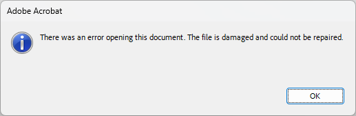

# 손상된 PDF 업로드 시 파이프라인 에러 처리 미흡

**일자:** 2026-03-28
**상태:** Open
**영역:** 백엔드 - xPipe 파이프라인 (extract 스테이지), 프론트엔드 - 진행률 표시
**보고 계기:** 송유미 설계사 업로드 파일 1건 에러 상태 멈춤

---

## 현상

송유미 설계사가 업로드한 PDF 1건이 파이프라인 처리 중 에러 발생.
**UI에서는 진행률 100%로 표시**되어 사용자는 에러를 인지할 수 없었음.

---

## 해당 문서 정보

| 항목 | 값 |
|------|-----|
| `_id` | `69c69487fa2ef19c74119d49` |
| 원본 파일명 | `12042022074213.pdf` |
| 서버 경로 | `/data/files/users/69875e2b4c2149195032adc6/2026/03/260327234449_80df8d0c.pdf` |
| 파일 크기 | 5,321,110 bytes (5.07MB) |
| ownerId | `69875e2b4c2149195032adc6` (youmi / 송유미) |
| customerId | `69c69267e73f522062f59bdf` |
| 업로드 시각 | 2026-03-27T14:30:31 UTC |
| 에러 시각 | 2026-03-27T14:44:50 UTC (업로드 후 약 14분) |

### 파이프라인 에러 메시지

```
파이프라인 'aims-xpipe' 스테이지 'extract' 실행 실패:
Upstage API 오류 (400): The document is empty.
```

### DB 상태 (에러 당시)

```
overallStatus: "error"
progress: 40
progressStage: "processing"
```

### UI 표시 상태

**DB는 error/progress 40인데, UI에서는 진행률 100%로 표시됨.**
사용자는 정상 완료된 것으로 인식 — 에러 상태를 알 수 없음.

> 참고: 해당 문서의 DB 레코드는 현재 존재하지 않음. 디스크 파일은 서버에 그대로 존재.

---

## 파일 손상 분석

### 손상 유형: Truncated PDF (파일 끝 잘림)

PDF 헤더는 정상이나, **파일 끝이 중간에 잘려 있어** 필수 구조가 누락됨.

| 검증 항목 | 결과 | 정상 PDF 기준 |
|-----------|------|---------------|
| 파일 헤더 | `%PDF-1.3` (정상) | `%PDF-x.x` |
| `%%EOF` 마커 | **없음** | 파일 끝에 필수 |
| `startxref` | **없음** | `%%EOF` 직전에 필수 |
| `xref` 테이블 | **없음** | 오브젝트 위치 색인, 필수 |
| `/Type /Page` | 20개 발견 | 페이지 정의 존재 |
| `/Subtype /Image` | 21개 발견 | 스캔 이미지 존재 |
| `obj` / `endobj` | 82 / 81 (불일치) | 반드시 1:1 대응 |
| `stream` / `endstream` | 81 / 40 (불일치) | 반드시 1:1 대응 |
| `CreationDate` | `D:20220412080914+09'00'` | 2022-04-12 생성 |

**파일 끝 바이너리** (마지막 50바이트):
```
...TT\x07N\x89\x98\x8d\x83\x8a\x97.\xc1\x14x0\xd1\xef\xca\xe4\xb3UX\xb4\xed@K\x86-^\xfd\xfd\x97\x19\xfe\x11\xc5S}6-\xe3*\x06
```
→ 이미지 스트림 바이너리 데이터 중간에서 파일이 끊김. PDF 정상 종료 구조(`xref` → `startxref` → `%%EOF`)가 전혀 없음.

### 핵심 지표: stream/endstream 불일치

- `stream` 81개 vs `endstream` 40개 → **41개 스트림이 닫히지 않은 채 파일이 잘림**
- `obj` 82개 vs `endobj` 81개 → **1개 오브젝트가 미완성**
- 이는 파일 전송/저장 과정에서 중간에 끊긴 전형적인 truncation 패턴

### 각 도구별 검증 결과

| 도구 | 결과 | 에러 메시지 |
|------|------|-------------|
| `file` 명령 | PDF 인식 (헤더만 확인) | `PDF document, version 1.3` |
| **Adobe Acrobat** | **열기 불가, 복구 불가** | `The file is damaged and could not be repaired.` |
| **pdfplumber** | **파싱 실패** | `PdfminerException: Unexpected EOF` |
| **PyPDF2** | **파싱 실패** | `PdfReadError: EOF marker not found` |
| **Upstage OCR API** | **처리 거부** | `400: The document is empty` |



### 결론

원본 파일(`12042022074213.pdf`, 2022-04-12 생성)이 **이미 손상된 상태로 업로드**됨.
파일명 패턴으로 보아 스캔/자동 다운로드 과정에서 전송이 중단되어 truncated된 것으로 추정.
**복구 불가능** — 원본 재확보 후 재업로드만 가능.

---

## 문제점

### 1. 손상 파일 사전 감지 없음

pdfplumber에서 `Exception`이 발생하면 빈 문자열을 반환하고 넘어간다.
"텍스트가 없는 정상 PDF(스캔 이미지 PDF)"와 "파싱 자체가 불가능한 손상 PDF"를 구분하지 않는다.

```python
# extract.py - _read_pdf_file()
except Exception:
    return ""  # 손상 파일도 "텍스트 없음"으로 처리 → OCR로 넘어감
```

### 2. 불필요한 유료 API 호출

pdfplumber가 파싱조차 못한 파일을 Upstage OCR에 전송하는 것은 의미 없는 크레딧 소비.
손상 파일은 OCR 호출 전에 차단해야 한다.

### 3. 사용자 안내 메시지가 기술적

에러 메시지 `Upstage API 오류 (400): The document is empty`는 일반 사용자가 이해할 수 없다.
"파일이 손상되어 처리할 수 없습니다" 등 원인을 알 수 있는 안내가 필요.

### 4. UI 진행률 100% 오표시

DB 상태는 `overallStatus: "error"`, `progress: 40`인데, **UI에서는 진행률이 100%로 표시**.
사용자는 정상 완료로 인식하여 에러 상태를 알 수 없음 — 치명적 UX 문제.

---

## 개선 방안

### Phase 1: pdfplumber 실패 시 손상 감지 + OCR 호출 차단

extract 스테이지의 `_read_pdf_file()`에서 pdfplumber `Exception` 발생 시:

1. "텍스트 없음"이 아닌 **"파일 손상"으로 구분**하여 플래그 설정
2. 손상 플래그가 설정된 경우 **Upstage OCR 호출 스킵** (크레딧 절약)
3. 문서 상태를 `error`로 전환하되, **사용자 친화적 에러 메시지** 저장

```
에러 메시지 예시:
"파일이 손상되어 내용을 읽을 수 없습니다. 원본 파일을 확인하신 후 다시 업로드해 주세요."
```

### Phase 2: UI 에러 상태 표시 수정

프론트엔드 진행률 표시 로직에서 `overallStatus: "error"` 상태를 올바르게 반영.
에러 문서가 100%로 표시되지 않도록 수정.

### Phase 3: 업로드 시점 사전 검증 (선택)

업로드 단계에서 PDF 구조 유효성을 빠르게 검증하여, 손상 파일은 업로드 자체를 거부하거나 경고.
단, 업로드 속도에 영향을 줄 수 있으므로 PoC 필요.

---

## 관련 코드

| 파일 | 역할 |
|------|------|
| `backend/api/document_pipeline/xpipe/stages/extract.py` | extract 스테이지 (pdfplumber + OCR 호출) |
| `backend/api/document_pipeline/xpipe/providers_builtin.py` | Upstage OCR API 호출 |
| `backend/api/document_pipeline/xpipe/pipeline.py` | 파이프라인 엔진 (에러 전파) |
| 프론트엔드 진행률 표시 컴포넌트 | 문서 상태별 진행률 렌더링 (조사 필요) |

---

## 로컬 파일 백업

분석용으로 서버에서 다운로드한 손상 파일:
`D:\tmp\260327234449_80df8d0c.pdf`
