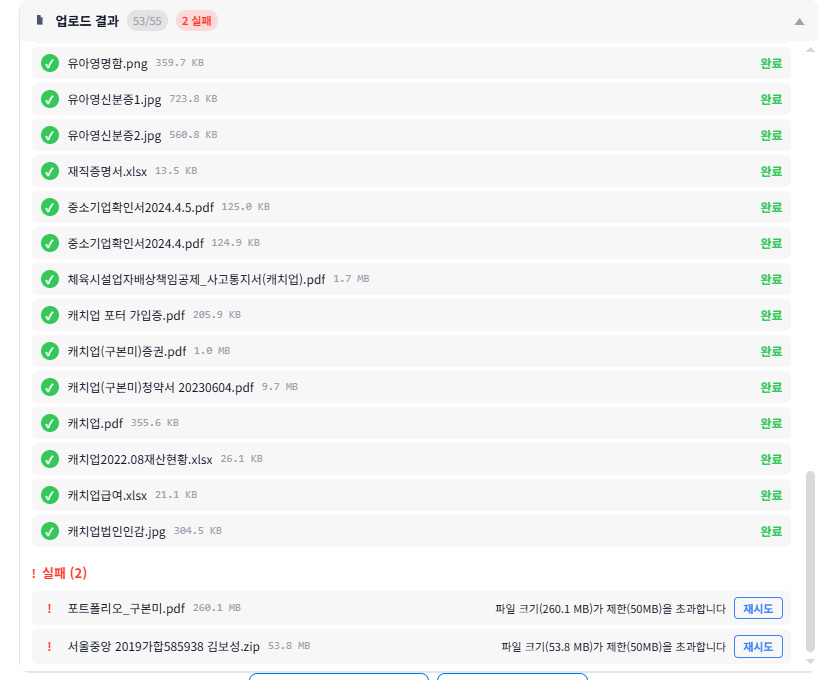

# 파일 업로드 50MB 제한 UX 문제

**일자:** 2026-02-22
**상태:** Open
**영역:** 프론트엔드 - 문서 등록 (DocumentRegistrationView)

---

## 용어 정의

본 문서에서 사용하는 용어를 명확히 구분한다.

### 업로드 (Upload)
파일을 서버로 전송하여 **디스크에 저장**하고 **MongoDB에 문서 레코드를 생성**하는 단계.
- 브라우저 → Nginx → FastAPI → 디스크 저장 + DB 레코드
- 비용: 디스크 공간만 소비 (AI 비용 없음)
- 이 단계에서 AR/CRS 감지, 메타데이터 추출도 수행 (pdfplumber 기반, 로컬 처리, 비용 없음)

### 유료 API 처리
업로드 완료 후, 외부 유료 API를 호출하여 문서를 분석하는 단계. **크레딧을 소비**한다.

| 단계 | 외부 API | 비용 | 트리거 |
|------|---------|------|--------|
| **OCR** | Upstage API | 2 크레딧/페이지 | 스캔된 PDF·이미지 → 텍스트 변환 (텍스트 기반 PDF는 스킵) |
| **임베딩** | OpenAI `text-embedding-3-small` | 0.5 크레딧/1K토큰 | 텍스트 → 벡터 변환 (RAG 검색용) |
| **요약** | OpenAI | 토큰 기반 | 문서 내용 요약 생성 |

### 비용이 없는 처리 (로컬)
- AR/CRS 감지: pdfplumber 기반 텍스트 분석 (외부 API 호출 없음)
- 메타데이터 추출: MIME 타입, 페이지 수 등 (로컬)
- 텍스트 기반 PDF의 텍스트 추출: pdfplumber (로컬)

---

## 현상

55개 파일을 일괄 업로드할 때, 50MB를 초과하는 2개 파일이 실패 처리됨.



- 업로드 결과: 53/55 성공, 2 실패
- 실패 파일:
  - `포트폴리오_구본미.pdf` (268.1 MB) — "파일 크기(260.1 MB)가 제한(50MB)을 초과합니다"
  - `서울중앙 2019가합585938 김보성.zip` (53.8 MB) — "파일 크기(53.8 MB)가 제한(50MB)을 초과합니다"

---

## 문제점

### 1. "재시도" 버튼이 의미 없음
파일 크기 초과는 **영구적 실패**로, 재시도해도 절대 성공할 수 없다. 그런데 "재시도" 버튼이 노출되어 사용자가 헛된 시도를 하게 만든다. 항상 실패할 행동을 유도하는 것은 UX 안티패턴이다.

### 2. 파일 크기 표시 불일치
파일명 옆에는 `268.1 MB`로 표시되지만, 에러 메시지에서는 `260.1 MB`로 표시된다. 같은 파일인데 크기가 다르게 보이면 시스템 신뢰도가 떨어진다.

### 3. 사용자에게 해결 방법이 없음
"파일 크기가 제한을 초과합니다"라는 사실만 알려줄 뿐, 사용자가 **무엇을 할 수 있는지** 안내가 전혀 없다. 막다른 길(dead-end)에 놓이는 경험이다.

### 4. 50MB 제한의 적절성 의문
보험 업무 특성상 포트폴리오, 청약서 등 대용량 파일이 흔하다. 53.8 MB처럼 제한을 겨우 넘는 파일도 일괄 차단되는 것이 업무 현실에 맞는지 검토 필요하다.

---

## 관련 코드

| 항목 | 파일 | 라인 |
|------|------|------|
| 50MB 제한 정의 | `frontend/aims-uix3/src/components/DocumentViews/DocumentRegistrationView/services/userContextService.ts` | 183 |
| 크기 검증 로직 | `frontend/aims-uix3/src/components/DocumentViews/DocumentRegistrationView/services/uploadService.ts` | 651-662 |
| 크기 초과 모달 | `frontend/aims-uix3/src/utils/appleConfirm.ts` | 248-407 |
| 검증 실패 처리 | `frontend/aims-uix3/src/components/DocumentViews/DocumentRegistrationView/DocumentRegistrationView.tsx` | 971-1007 |
| HTTP 413 에러 처리 | `frontend/aims-uix3/src/components/DocumentViews/DocumentRegistrationView/services/uploadService.ts` | 561-563 |
| 파일 목록 UI / 재시도 | `frontend/aims-uix3/src/components/DocumentViews/DocumentRegistrationView/FileList/FileList.tsx` | - |
| 백엔드 크기 제한 | Nginx `client_max_body_size` (코드 주석 참조) | - |

---

## 인프라 현황 조사 (2026-02-22)

Nginx 설정을 실제 서버에서 확인한 결과:

| 위치 | 설정 | 비고 |
|------|------|------|
| **서버 레벨** (`aims.giize.com :443`) | `client_max_body_size 10G` | 이미 10GB 허용 |
| **`/shadow/` 로케이션** (업로드 경로) | `client_max_body_size 50M` | **병목 지점** |
| **`nginx.conf` 전역** | `client_max_body_size 50M` | 전역 기본값 |
| **프론트엔드** (`userContextService.ts:183`) | `maxFileSize: 50MB` | "Nginx 제한에 맞춤" 주석 |
| **백엔드** (FastAPI) | 명시적 제한 없음 | Nginx에 의존 |

**핵심 발견:** 서버 레벨은 이미 10GB를 허용하고 있으나, `/shadow/` 로케이션만 50MB로 제한. 프론트엔드는 이 50MB에 맞춘 것.

---

## 유료 API 비용 분석 (2026-02-22) — 실제 데이터 기반

### 실제 DB 통계 (files 컬렉션, 1,207개 문서)

| 항목 | 값 |
|------|-----|
| 총 파일 수 | 1,207개 |
| 총 디스크 사용량 | 405 MB |
| 평균 파일 크기 | **344 KB** |
| 최대 파일 크기 | **12.5 MB** (캐치업윤명희청약서.pdf, 31페이지) |
| 총 페이지 수 | 7,496 페이지 |
| 총 임베딩 청크 | 8,082개 |

### 텍스트 추출 방식 분포 (text_source)

| 방식 | 파일 수 | 비율 | 비용 |
|------|--------|------|------|
| **meta** (pdfplumber 로컬 추출) | 1,183 | **98.0%** | **무료** |
| **ocr** (Upstage API) | 11 | **0.9%** | 유료 |
| skipped | 13 | 1.1% | - |

현재 테스트 환경에서는 텍스트 기반 PDF가 대다수(98%)이나, **이는 테스트 데이터의 특성이지 실 운영 환경을 대표하지 않는다.** 보험 업무에서는 스캔 문서, 사진 촬영 서류, 이미지 기반 PDF가 상당 비율을 차지할 수 있으며, 이 경우 OCR 비용이 크게 증가한다.

### 비용 시나리오 (텍스트 기반 vs 스캔 기반)

대용량 파일(예: 268MB, 500페이지 PDF)이 업로드되었을 때:

| 시나리오 | OCR 비용 | 임베딩 비용 | 총 크레딧 |
|---------|---------|-----------|----------|
| **텍스트 기반 PDF** | 0 (pdfplumber 로컬) | ~100 | ~100 |
| **스캔 기반 PDF** | 1,000+ (2크레딧×500p) | ~100 | **~1,100+** |

→ 동일 파일이라도 텍스트/스캔 여부에 따라 비용이 **10배 이상** 차이남.
→ 실 운영에서 스캔 PDF 비율이 어느 정도인지는 아직 알 수 없음.

### 업로드 후 처리 파이프라인

```
[업로드] 파일 전송 → 디스크 저장 → DB 레코드 생성 → 메타데이터/AR/CRS 감지 (로컬, 무료)
                                                          ↓
                                              텍스트 기반 PDF? ──Yes──→ pdfplumber 추출 (무료)
                                                    │No
                                                    ↓
[유료 API] OCR (페이지별, Upstage) → 텍스트 추출
                ↑
           2 크레딧/페이지
                                                    ↓
                                        청크 분할 → 임베딩 (청크별, OpenAI)
                                                            ↑
                                                     0.5 크레딧/1K토큰
```

### ZIP 파일 — 추가 발견

`서울중앙 2019가합585938 김보성.zip`은 50MB 제한과 관계없이 **어차피 거부됨**.
- `doc_prep_main.py`에서 `application/zip`은 `UNSUPPORTED_MIME_TYPES`에 포함
- HTTP 415 (Unsupported Media Type) 응답
- 현재 ZIP 업로드는 아예 불가능 (별도 이슈)

### 크레딧 안전장치 (이미 존재)

시스템에 이중 관문(Double-Gating) 설계가 있음:
1. **업로드 시** — 크레딧 사전 체크 → 부족 시 `credit_pending` (파일은 저장, 유료 API 처리 보류)
2. **유료 API 호출 전** — OCR/임베딩 전 재체크 → 부족 시 스킵
3. **충전 시** — `credit_pending` 문서 자동 재처리

### 설계 원칙

**1. 업로드(디스크 저장)는 자유롭게 허용해도 된다.**
- 디스크 비용만 발생, 리스크 낮음

**2. 유료 API 처리의 제어되지 않는 비용 폭증이 최대 위험 요소이다.**
- 업로드 제한을 올리는 것 자체는 쉽다. 진짜 문제는 올린 파일이 자동으로 유료 API 파이프라인에 들어갈 때 발생한다.
- 현재 시스템은 업로드 → 유료 API 처리가 **자동 연결**되어 있어, 대용량 파일이 들어오면 사용자 인지 없이 크레딧이 대량 소비될 수 있다.
- 스캔 PDF 500페이지 = ~1,100+ 크레딧. Standard 월정액(2,000)의 절반 이상이 파일 1개에 사라질 수 있다.
- **어떤 해결 방안을 선택하든, 유료 API 처리 비용이 제어 가능해야 한다.**

---

## Gini 품질 검증 — 크레딧 안전장치 취약점 (2026-02-22)

Gini가 코드 검증 중 현행 크레딧 안전장치에서 **구조적 취약점 3건**을 발견. 업로드 제한 상향 여부와 무관하게 현재도 존재하는 문제.

### [Critical] 1차 크레딧 체크가 항상 1페이지로 추정

```python
# doc_prep_main.py:235
estimated_pages = 1  # 고정값! 500페이지 파일도 1페이지로 체크
credit_check = await check_credit_for_upload(userId, estimated_pages)
```
→ 크레딧이 2~10만 남아도 500페이지 스캔 PDF가 통과됨.

### [Critical] fail-open 설계가 양쪽 관문 모두 무력화

```python
# doc_prep_main.py:79-85 — 1차 관문
except Exception as e:
    return {"allowed": True, "reason": "error_fallback"}  # 오류 시 무조건 허용

# ocr_worker.py:141-144 — 2차 관문
except Exception as e:
    return {"allowed": True}  # 오류 시 무조건 허용
```
→ aims_api 일시 불안정 시 모든 파일이 무제한 처리됨.

### [Critical] OCR 워커에서 요약 시 owner_id 미전달

```python
# ocr_worker.py:170
result = await self.openai_service.summarize_text(ocr_result["full_text"])
# owner_id 미전달 → 크레딧 체크 완전 생략
```

### [Major] 추가 발견

- FastAPI 레벨에 서버사이드 파일 크기 검증 없음 (Nginx만 의존)
- 대용량 파일 전체를 메모리에 이중 로딩 (`file.read()` + 워커 재로딩)
- OCR 타임아웃(120초) 후 크레딧 환불 로직 없음

---

## 본질적 개선안 (2026-02-22)

### 근본 인식

**파일 크기 제한은 비용 통제 수단이 아니다.**

- 파일 크기(MB)와 처리 비용(크레딧)은 상관관계가 없다
- 10MB 500페이지 스캔 PDF > 268MB 10페이지 이미지 PDF (비용 50배 차이)
- "50MB 제한"은 비용이 무서우니 문을 잠근 것이지, 비용을 통제한 것이 아니다
- **비용을 통제하려면 비용을 통제해야 한다. 크기를 통제하면 안 된다.**

### 세 축 설계

이 문제는 세 가지를 동시에 설계해야 한다. 어느 하나만 풀면 다른 곳이 무너진다.

---

### 축 1. 사용자 경험 설계

> 사용자가 파일을 올릴 때 어떤 경험을 해야 하는가?

**원칙: 막다른 길 없음 · 투명함 · 선택권**

| 현재 | 개선 |
|------|------|
| 50MB 초과 → "크기 초과" 에러 → 재시도 버튼 (소용없음) → 막다른 길 | 파일 크기와 무관하게 업로드 성공 |
| 성공/실패만 표시, 비용 정보 없음 | 업로드 후 파일 정보(페이지 수, 유형, 예상 비용) 표시 |
| 처리가 자동으로 진행, 사용자 인지 없음 | 고비용 문서는 사용자에게 사전 고지 후 처리 |
| 크레딧 부족 시 "credit_pending" (개발자 용어) | "크레딧 부족 — 충전 후 자동 처리됩니다" (사용자 언어) |

**사용자 흐름:**
```
파일 선택 → 업로드 (항상 성공)
   → 시스템이 파일 분석 (페이지 수, 텍스트/스캔 판별 — 무료)
   → 사용자에게 결과 표시:
      · 일반 문서: 자동 처리 (비용 소액, 별도 확인 불필요)
      · 고비용 문서: "500페이지 스캔 PDF, 예상 ~1,100 크레딧"
        → [처리하기] [나중에 처리]
      · 크레딧 부족: "크레딧이 부족합니다" → [충전하기] [보관만 하기]
```

**핵심:** 사용자는 절대 "안 됩니다"를 만나지 않는다. 항상 다음 행동이 있다.

---

### 축 2. 사용자 비용 설계

> 사용자가 자신의 비용을 예측하고 통제할 수 있는가?

**원칙: 사전 고지 · 예측 가능 · 사용자가 결정**

**현재 문제:**
- 업로드하면 자동으로 유료 처리 진입 → 사용자 모르게 크레딧 소비
- 500페이지 스캔 PDF 1개가 월정액(2,000)의 55%를 소비할 수 있음
- `estimated_pages=1` 버그로 크레딧 체크 자체가 무의미

**설계:**

| 구분 | 기준 | 동작 |
|------|------|------|
| **소액 처리** | 예상 비용 ≤ N 크레딧 (임계값 TBD) | 자동 처리 (기존과 동일) |
| **고액 처리** | 예상 비용 > N 크레딧 | 비용 표시 → 사용자 확인 후 처리 |
| **크레딧 부족** | 잔여 크레딧 < 예상 비용 | 파일 보관 + 충전 안내 |

- "고액 처리" 임계값은 요금제별로 다를 수 있음 (Standard 월 2,000 기준 100? 200?)
- 임계값 이하는 기존처럼 자동 처리하여 대다수 일반 문서의 UX를 해치지 않음
- 임계값 이상만 사용자 확인을 요구하여 "비용 폭탄" 방지

---

### 축 3. 시스템 비용 설계

> 시스템이 감당 못할 비용이 통제 없이 발생하지 않는가?

**원칙: 정확한 계량 · 안전 장치 · 지속 가능한 운영**

**현재 문제:**
- `estimated_pages=1` → 500페이지도 1페이지로 계산 (크레딧 체크 무력화)
- fail-open → 오류 시 모든 파일 무제한 처리 허용
- OCR 워커에서 owner_id 미전달 → 크레딧 체크 완전 생략
- 시스템 자체의 비용 상한이 없음

**설계:**

| 계층 | 통제 수단 | 목적 |
|------|----------|------|
| **정확한 계량** | 실제 페이지 수 기반 크레딧 체크 (`estimated_pages=1` 수정) | 크레딧 = 실제 비용 |
| **안전 밸브** | fail-closed (오류 시 처리 보류, 허용 아님) | 장애 시 비용 누수 방지 |
| **단일 파일 상한** | 파일 1개당 최대 처리 비용 상한 (예: 5,000 크레딧) | 이상 파일에 의한 폭주 방지 |
| **사용자별 상한** | 일/월 처리량 상한 (요금제별) | 시스템 전체 비용 예측 가능 |
| **디스크 상한** | 사용자별 저장 용량 상한 | 무제한 저장 방지 |

- 사용자 크레딧은 "사용자 지갑"이고, 시스템 상한은 "시스템 안전장치"
- 둘 다 있어야 한다. 사용자 크레딧만으로는 시스템 비용을 통제할 수 없음
  (예: 무료 체험 사용자가 대용량 파일 수십 개 업로드)

---

### 현행 버그 (어떤 방안이든 선결 수정)

위 설계와 무관하게, 현재 크레딧 시스템에 구조적 결함이 존재한다:

| # | 심각도 | 내용 | 위치 |
|---|--------|------|------|
| B1 | Critical | `estimated_pages=1` 고정 → 크레딧 체크 무력화 | `doc_prep_main.py:235` |
| B2 | Critical | fail-open (오류 시 무조건 허용) → 비용 통제 무력화 | `doc_prep_main.py:79`, `ocr_worker.py:141` |
| B3 | Critical | OCR 워커 요약 시 owner_id 미전달 → 크레딧 체크 생략 | `ocr_worker.py:170` |
| B4 | Major | 서버사이드 파일 크기 검증 없음 (Nginx만 의존) | `doc_prep_main.py` |

---

### 구현 순서

```
Phase 0: 선결 버그 수정 (B1~B4)
   → 크레딧 시스템이 정확하게 동작하는 상태 확보

Phase 1: 업로드 제한 철폐
   → Nginx/프론트엔드 파일 크기 제한 상향 (실용적 상한, 예: 1GB)
   → 디스크 저장 + 무료 메타 분석은 자유롭게

Phase 2: 비용 투명성 UX
   → 업로드 후 파일 정보(페이지 수, 유형, 예상 비용) 표시
   → 고비용 문서 사전 확인 UX
   → 크레딧 부족 시 사용자 언어 안내

Phase 3: 시스템 안전장치
   → 단일 파일 처리 상한, 사용자별 상한, 디스크 상한
   → 모니터링/알림
```

---

## Alex·Gini 비평 (2026-02-22)

### Alex (아키텍트) — "선택하게 하지 마라"

**원안의 "분석 범위 선택 (전체/요약/보관)" UX가 최대 약점이다.**

1. **결정 피로**: 설계사는 하루 수십 건 업로드. 매번 분석 범위를 고르게 하면 업로드 자체가 부담. AIMS의 핵심 가치는 "던지면 알아서 처리"인데 이걸 깨뜨린다.
2. **선택 기준 부재**: "요약만"과 "전체 분석"의 실무적 차이를 설계사가 모른다. "요약만 하면 검색 안 되나요?" CS 폭주.
3. **"보관만" 불필요**: AIMS는 파일 보관소가 아니라 지능형 문서 관리 시스템. 분석 안 할 문서는 AIMS에 올릴 이유가 없다.
4. **기준 오류**: 30페이지 기준은 임의적. 30p 스캔 PDF vs 30p 텍스트 PDF = 비용 10배 차이. **페이지 수가 아니라 예상 크레딧이 기준**이어야 한다.

**Alex 대안:**
> 시스템이 자동 처리하되, **예상 비용이 임계값을 넘을 때만** 사용자에게 한 번 확인.
> "이 문서는 약 1,100 크레딧입니다. 처리할까요?" — 이것만 물어라.
> 소액 문서는 팝업 없이 기존처럼 자동 처리.
> 크레딧 부족이면 기존 credit_pending 그대로 사용 (새 상태 불필요).

**Alex 추가 지적:**
- 중복 업로드 체크(해시) 설계에 없음 — 같은 파일 2번 올리면 크레딧 2배 소모
- "보관만" 문서는 AI 검색 불가 → 설계사가 "왜 못 찾냐" 항의 예상
- credit_pending에서 충전 후 자동 재처리 UX가 명확해야 함

---

### Gini (품질 검증) — "보관만 상태가 만드는 연쇄 문제"

**QUALITY GATE: FAIL**

1. **[Critical] credit_pending과 "보관만" SSOT 위반**: 둘 다 "분석 안 된 문서"이지만 처리 방식이 달라야 함. 크레딧 충전 시 자동 재처리가 "보관만"까지 건드릴 위험.

2. **[Major] AR/CRS 감지와 모순**: "보관만"이면 AR 감지를 하나? 하면 고객 생성되는데 분석은 안 됨. 안 하면 기존 동작(credit_pending에서도 AR 감지는 수행)과 불일치.

3. **[Major] 상태 폭발**: 현행 상태 필드만 해도 `overallStatus / ocrStatus / status / progressStage / ar_parsing_status / cr_parsing_status / ocr.status / docembed.status`. 여기에 "보관만/요약만/전체분석/분석대기" 추가하면 전이 규칙이 기하급수적으로 복잡해짐.

4. **[Major] 청크 처리 중간 실패**: 300페이지 중 150에서 실패하면 상태는? 재시작점은? 이미 쓴 크레딧 환불은? 설계안에서 가장 복잡한 부분이 가장 적게 설명됨.

5. **[Major] 메모리 위험**: 현행 `doc_prep_main.py:225`에서 `file.read()`로 전체 메모리 로드. 50MB → 500MB로 올리면 동시 업로드 시 OOM. **스트리밍 저장이 선행 필수.**

6. **[Major] "보관만" 고아 문서**: 만료 정책 없으면 디스크만 차지하며 영원히 쌓임. 디스크 상한과도 충돌.

---

### Alex·Gini 공통 합의점

| 항목 | 합의 |
|------|------|
| "보관만" 옵션 | **제거 또는 근본 재설계** — 문제가 너무 많음 |
| 분석 범위 매번 선택 | **과도한 UX 부담** — 시스템 자동 + 고비용만 확인 |
| 소형/대형 기준 | 페이지 수 ❌ → **예상 크레딧 소비량** ✅ |
| B1~B4 선결 수정 | **어떤 설계든 먼저 수정 필수** |
| 메모리 안전 | file.read() 전체 로드 → **스트리밍 저장 선행** |

---

### 비용 구조 정정 (2026-02-22)

이전 설계안에서 "스캔 PDF = 고비용, 텍스트 PDF = 저비용"으로 전제한 것은 **오류**였다.

**실제 비용 구조:**

| 처리 단계 | 대상 | 비용 기준 |
|-----------|------|-----------|
| **임베딩** (OpenAI) | **모든 문서** | 텍스트 양(토큰)에 비례 |
| **요약** (OpenAI) | **모든 문서** | 텍스트 양(토큰)에 비례 |
| **OCR** (Upstage) | 스캔 문서만 | 페이지 수에 비례 |

→ 500페이지 텍스트 PDF도 텍스트 양이 방대하면 임베딩+요약 비용이 상당함.
→ OCR은 추가 비용일 뿐, 비용의 전부가 아님.
→ **"고비용"의 기준은 스캔/텍스트 구분이 아니라 "총 예상 크레딧 소비량"이다.**

고비용 판단 = 처리 전에 전체 예상 크레딧(OCR + 임베딩 + 요약)을 계산 → 합계가 임계값 초과 시 고비용.

---

### 고비용 문서 기준 (2026-02-22 토의 확정)

**기준선: 월정액의 10%**

| 요금제 | 월정액 | 고비용 임계값 |
|--------|--------|-------------|
| Standard | 2,000 | **200 크레딧** |
| Pro | 5,000 | **500 크레딧** |

**근거:**
- 평균 문서 (6페이지): 텍스트 ~4 크레딧, 스캔 ~16 크레딧, 혼합 추정 ~8 크레딧
- 200 크레딧 ≈ 일반 문서 25~50건분 ≈ 영업일 2~5일치
- 파일 1개가 이 이상을 소비하면 사용자에게 사전 고지가 합리적
- 일반 보험 문서 (청약서, 증권, AR 등 2~30페이지)는 절대 해당 안 됨
- 해당되는 건: 대형 포트폴리오, 수백 페이지 합본 PDF 등 예외적 문서뿐

**비용 추정 공식 (합리적 추산):**
```
예상 크레딧 = (페이지 수 × 페이지당 평균 토큰 × 임베딩+요약 단가)
            + (스캔이면 페이지 수 × OCR 단가)
```
- 정확한 수치는 운영 데이터 축적 후 보정
- 임계값은 설정값(configurable)으로 구현하여 운영 중 조정 가능

---

## 사용자 기본안 (2026-02-22)

### 핵심 인식: 파일 사이즈와 AI 처리 사이즈는 별개 문제

업로드 시 두 가지 관점이 존재하며, 이 둘은 **독립적**이다:

| 관점 | 관심사 | 제한 기준 |
|------|--------|-----------|
| **파일 사이즈** | 서버가 물리적으로 받을 수 있는가 | 사용자 저장 용량 (디스크) |
| **AI 처리 사이즈** | 받은 파일을 처리하는 데 비용이 얼마나 드는가 | 크레딧 (비용 + 효용) |

268MB 10페이지 PDF → 파일 사이즈 크지만 AI 처리 소액.
5MB 500페이지 스캔 PDF → 파일 사이즈 작지만 AI 처리 거액.
**파일 사이즈 제한으로 AI 비용을 통제하는 것은 원리적으로 불가능하다.**

### 설계

#### 1. 파일 업로드 — 사용자 할당 용량 내 자유

- **단일 파일 크기 제한 없음** (사용자 저장 용량이 허용하는 한 모든 파일 수용)
- 사용자 저장 용량 = 요금제별 할당 (configurable)
- 용량 초과 시에만 업로드 거부
- 시스템 디스크 보호는 운영 모니터링 영역 (디스크 80% 알림, 95% 서킷 브레이커 등 — 별도 이슈)

#### 2. AI 처리 — 비용 + 효용 기반 분기

모든 파일을 무조건 AI 처리(OCR, 임베딩, 요약)하는 것은 실용적이지 않다.
대용량 파일은 AI 처리 비용이 높은데 효용이 불확실하다 (500페이지 합본 PDF의 임베딩은 검색 잡음, 요약은 무의미).
**시스템은 이 판단을 할 수 없다. 사용자만이 "이 파일을 AI 분석할 가치가 있는지" 판단할 수 있다.**

| 구분 | 조건 | 동작 |
|------|------|------|
| **자동 처리** | 예상 비용 ≤ 임계값 | 시스템 자동 처리 (기존과 동일, 사용자 개입 없음) |
| **사용자 판단** | 예상 비용 > 임계값 | 사용자에게 판단 위임 ("AI 분석할까요? 예상 ~N 크레딧") |
| **크레딧 부족** | 잔여 크레딧 < 예상 비용 | 기존 credit_pending (충전 시 자동 재처리) |

- 임계값은 configurable (운영 데이터로 튜닝)
- 대부분 파일(일반 보험 문서 2~30페이지)은 자동 처리 → AIMS "던지면 알아서" 원칙 유지
- 고비용 파일에서만 사용자에게 묻는 이유: 비용 확인이 아니라 **효용이 불확실**하므로

### 이전 "보관만"과의 차이

| | 폐기된 "보관만" | 이 기본안 |
|---|---|---|
| 대상 | 모든 파일마다 선택 | 고비용 파일에서만 |
| 발생 빈도 | 매번 (결정 피로) | 거의 없음 (예외적 대용량만) |
| 사용자 판단 근거 | "비용을 아끼고 싶다" | "이 파일에 AI가 효용이 있는가" |
| "나중에" 옵션 | 있음 (상태 관리 문제) | 없음 ([처리하기] / [취소]만) |

### 선결 과제 (기본안과 무관하게 즉시)

| 순서 | 내용 | 이유 |
|------|------|------|
| 1 | B2: fail-open → fail-closed | 가장 긴급, 비용 통제 무력화 |
| 2 | B1: estimated_pages=1 → 실제 페이지 수 | 크레딧 체크 정상화 |
| 3 | B3: OCR 워커 owner_id 전달 | 크레딧 체크 누락 |
| 4 | 스트리밍 저장 (file.read() → 청크) | 대용량 파일 OOM 방지 |
| 5 | B4: FastAPI 레벨 크기 검증 | Nginx만 의존 제거 |

---

### 토의 이력: 폐기된 안들

| 폐기된 안 | 폐기 이유 | 비평자 |
|-----------|----------|--------|
| "보관만/요약만/전체분석" 선택 | 결정 피로, AIMS "던지면 알아서" 핵심 가치 훼손 | Alex 1차 |
| "보관만" 옵션 | credit_pending과 SSOT 위반, 상태 폭발, 고아 문서 | Gini 1차 |
| 30페이지 기준 | 페이지 수 ≠ 비용. 30p 스캔 vs 30p 텍스트 = 10배 차이 | Alex 1차 |
| "나중에 처리" 옵션 | "보관만"의 3번째 환생. 동일 문제 재발 | Alex·Gini 2차 |

---

## Alex·Gini 2차 비평 (2026-02-22) — 최종안 검토

### Alex (아키텍트) — "Phase 2는 과잉 설계, Phase 0이 먼저다"

**종합: 방향은 옳으나 실행 설계에 구멍이 있다.**

#### 1. "나중에 처리" = "보관만"의 변형

> "보관만" 옵션을 제거했고, AIMS는 "던지면 알아서 처리"가 핵심 가치라고 했다.
> 그렇다면 **"나중에 처리"라는 선택지 자체가 이전에 제거한 "보관만"의 변형이다.**
> 같은 문제가 다른 이름으로 돌아온 것이다.

- 올렸다는 것 자체가 처리 의사가 있다는 것
- 고비용 확인의 목적은 "이 비용을 쓸 것인가" 확인이지, "처리할지 말지" 결정이 아님
- **[처리하기] / [취소(업로드 철회)]만 있어야 한다. "나중에"는 없어야 한다.**

#### 2. Phase 2는 과잉 설계

- 현재 DB의 최대 파일: 12.5MB (31페이지). 200크레딧 임계값을 넘는 파일 = **0건**
- Phase 0(B1~B4 수정)만 완료되면 기존 credit_pending이 안전장치 역할을 수행
- 고비용 UX(Phase 2)는 "UX 개선"이지 "안전 장치"가 아님
- **실제로 고비용 파일이 발생한 후에 만들 것을 권고**

#### 3. 일괄 업로드 UX 미정의

- 55개 중 3개 고비용 → 다이얼로그 3번 연속 = UX 파탄
- **"3개 파일, 총 예상 2,340 크레딧. 처리하시겠습니까?" 일괄 요약 1회면 충분**
- 개별 파일별 확인은 과도

#### 4. fail-open(B2)이 가장 긴급

> aims_api가 1분만 불안정해도 그 사이 모든 파일이 무제한 처리됨.
> B1(estimated_pages=1)과 결합되면: 크레딧 체크 자체가 무의미하고, 무의미한 체크마저 건너뜀.
> **업로드 제한 올리든 말든 지금 당장 고쳐야 한다.**

#### 5. Alex 권고 실행 순서

```
긴급 (즉시):
  1. B2: fail-open → fail-closed
  2. B1: estimated_pages=1 → 실제 페이지 수
  3. B3: owner_id 전달

Phase 1 전제조건:
  4. 스트리밍 저장 (file.read() → 청크 기반)
  5. B4: FastAPI 레벨 크기 검증

Phase 1 (위 완료 후):
  6. Nginx/프론트엔드 크기 제한 상향 (500MB)
  7. "재시도" 버튼 수정 + 크기 표시 불일치 수정

Phase 2 (보류 — 실제 고비용 파일 발생 시에만):
  8. 비용 추정 및 사전 고지 UX
  9. 시스템 측 비용 상한
```

#### 6. 미해결 쟁점 답변

- **중복 업로드 해시 체크**: 지금은 하지 마라. "중복이란 무엇인가"의 정의가 복잡. 프론트엔드 세션 내 파일명+크기 중복 경고(기존 기능)로 충분
- **시스템 비용 상한**: 단일 파일 최대 = 크레딧 쿼터의 50% (Standard 1,000 크레딧). 지금은 값만 정하고 B1 수정에서 적용
- **비용 추정 정확도**: 약점이지만 치명적이지 않음. "약" 또는 "최대" 한정어 필수. OCR 비용(페이지×2)은 정확, 임베딩/요약은 근사치

---

### Gini (품질 검증) — QUALITY GATE: FAIL

#### 판정: 🔴 FAIL (6건)

| # | 심각도 | 이슈 |
|---|--------|------|
| 1 | Critical | "고비용 확인 대기" 문서의 overallStatus 미정의 → "유령 문서" 재발 가능 |
| 2 | Critical | "나중에 처리"와 credit_pending 상태 구분 없음 → 충전 시 의도치 않은 자동 재처리 |
| 3 | Major | 비용 추정 초과 시 정책 없음 → "약 200" 동의했는데 실제 500 소비 시 대응 없음 |
| 4 | Major | 확인 중 이탈 시나리오 미정의 → 파일은 저장됐으나 처리 결정 없는 문서 |
| 5 | Major | 일괄 업로드 시 고비용 확인 UI 미정의 → 다이얼로그 3번은 UX 파탄 |
| 6 | Major | TOCTOU — 확인 후 처리 전 크레딧 소진 시나리오 대응 없음 |

#### 통과 항목

- 근본 원인 해결 방향 (파일 크기 → 크레딧 기반 통제): PASS
- "보관만" 옵션 제거: PASS
- B1~B4 + 스트리밍 선행 조건: PASS
- 비용 임계값 configurable 설계: PASS

#### Gini 핵심 권고

1. **"나중에 처리" 옵션 제거** — 선택지는 [처리하기] / [취소] 둘만. credit_pending과의 SSOT 충돌 원천 차단
2. **고비용 확인 대기 상태 설계** — 프론트엔드 책임으로 이관, 백엔드는 `pending` 유지, 확인 후 처리 요청 API 호출. 새 상태 추가 불필요
3. **비용 추정 시 범위 표시** — "약 X 크레딧" 대신 "예상 200~400 크레딧". 실제 처리 후 사용 크레딧 알림
4. **이탈 시 만료 정책** — 업로드 후 N시간 내 처리 결정 없으면 자동 처리 또는 삭제
5. **TOCTOU 대응** — 처리 시작 직전 크레딧 재체크, 부족 시 credit_pending. 기존 이중 관문과 동일

---

### Alex·Gini 2차 공통 합의 (2026-02-22)

| 항목 | 합의 |
|------|------|
| "나중에 처리" 옵션 | **제거** — "보관만"과 동일 문제. 3번째로 같은 개념 재등장 |
| Phase 2 (비용 UX) | **보류** — Phase 0만으로 안전 확보 가능 |
| 일괄 업로드 확인 | **일괄 요약 1회** — 개별 다이얼로그 금지 |
| 상태 설계 | **구현 전 반드시 정의** — overallStatus 매핑 필수 |
| fail-open (B2) | **가장 긴급** — 즉시 수정 대상 |
| 중복 업로드 해시 체크 | **불필요** — 현재 피해 사례 없음, 기존 기능 충분 |

---

### 최종안 수정 방향 (2차 비평 반영)

**기존 최종안의 "비용 기반 3단계 분기"는 방향은 옳으나, Phase 0만으로 안전이 확보되는 상황에서 Phase 2(비용 투명성 UX)를 지금 만드는 것은 과잉 설계.**

**수정된 실행 계획:**

```
[즉시] Phase 0: 선결 버그 수정
  - B2: fail-open → fail-closed (가장 긴급)
  - B1: estimated_pages=1 → 실제 페이지 수
  - B3: OCR 워커 owner_id 전달
  → 이것만으로 크레딧 시스템이 정상 작동하여 비용 폭탄 자체 방어

[Phase 1 전제조건] 인프라 준비
  - 스트리밍 저장 (file.read() → 청크 기반 쓰기)
  - B4: FastAPI 레벨 파일 크기 검증

[Phase 1] 업로드 제한 상향 + UX 즉시 개선
  - Nginx/프론트엔드 파일 크기 제한 500MB로 상향
  - 영구 실패 시 "재시도" 버튼 제거 → "파일이 너무 큽니다 (500MB 초과)"
  - 파일 크기 표시 불일치 수정

[Phase 2] 비용 투명성 UX (보류 — 실제 고비용 파일 발생 시)
  - 업로드 후 예상 비용 표시
  - 고비용 문서 일괄 확인 UX ([처리하기] / [취소]만, "나중에" 없음)
  - 비용은 범위로 표시 ("예상 200~400 크레딧")
  - 시스템 측 비용 상한 (단일 파일 = 월정액의 50%)
```

**핵심 변경:**
1. "나중에 처리" 제거 (3번째 같은 개념 재등장 방지)
2. Phase 2를 보류로 강등 (Phase 0이 안전 확보)
3. 일괄 업로드 확인은 일괄 요약 1회

---

---

## Alex·Gini 3차 비평 (2026-02-22) — 사용자 기본안 검토

### Alex (아키텍트) — "이전 안보다 확실히 낫다"

**종합: 방향 올바름. "모든 파일을 AI 처리해야 한다"는 전제를 버린 것이 최대 장점.**

#### 핵심 지적: "AI 처리 안 함" 상태 설계가 관건

새로운 상태를 추가하면 "보관만" 재발. **속성의 부재**로 처리하면 안전:

| | "보관만" (폐기) | Alex 권고 |
|---|---|---|
| 상태 | `storage_only` (새 상태 추가) | `completed` (기존 상태 그대로) |
| 임베딩 | 별도 상태로 관리 | `embedding = null` (자연스러운 부재) |
| SSOT | 위반 | 유지 |
| "나중에 처리" | 별도 전이 필요 | 임베딩 트리거하면 됨 |

> **"보관만"은 상태를 추가한 것이고, 이 방식은 처리를 생략한 것이다. 상태가 추가되지 않으면 SSOT는 깨지지 않는다."**

#### 추가 권고

- 임계값 기준: **페이지 수**가 가장 실용적 (무비용 추출, 사용자 직관적)
- 사용자 판단 UX: 업로드 즉시 완료 → **문서 상세에서 "AI 분석 실행" 버튼** 제공 (업로드 흐름 끊지 않음)
- Phase 2와 메커니즘은 유사하나, "비용 때문에 막는다" vs "효용이 불확실하니 판단을 드린다"는 사용자 수용도에서 큰 차이

---

### Gini (품질 검증) — QUALITY GATE: FAIL (5건)

#### 판정: 🔴 FAIL

| # | 심각도 | 이슈 |
|---|--------|------|
| 1 | Major | "AI 처리 안 함" 선택 시 상태 이름 미정의 → SSOT 재발 가능 |
| 2 | Major | "고비용 확인 대기" overallStatus 미정의 |
| 3 | Major | 일괄 업로드 시 복수 고비용 파일 확인 UI 미정의 |
| 4 | Major | 이탈 시 만료 정책 미정의 → 좀비 상태 누적 |
| 5 | Major | 임계값 변경 시 기존 대기 파일 소급 적용 여부 미정의 |

#### 통과 항목

- 파일 크기 ≠ AI 비용 분리: PASS
- "나중에 처리" 제거: PASS
- 기본안 개념적 방향: PASS

#### Gini 핵심 권고

1. "AI 처리 안 함" = `completed` + `embedding = null` (Alex 권고 채택 시 해소)
2. 상태 다이어그램 한 장 추가하면 Major 이슈 대부분 해소
3. 일괄 업로드 확인 UI, 이탈 정책, 임계값 단위 → Phase 2 상세 설계 시 결정 가능

---

### Alex·Gini 3차 공통 합의 (2026-02-22)

| 항목 | 합의 |
|------|------|
| 기본안 방향 | **올바름** — 이전 안들보다 확실히 나음 |
| "AI 처리 안 함" 상태 | **새 상태 추가 금지** — `completed` + `embedding = null`로 표현 |
| 임계값 기준 | **페이지 수** 권고 (무비용, 직관적) |
| 상태 설계 | 기본안 확정 후 **상태 다이어그램** 작성 필요 |
| 상세 UX (일괄 확인, 이탈 정책 등) | **Phase 2 상세 설계 시 결정** — 기본안 방향과 무관 |

---

### 미결 사항 (기본안 확정 후 Phase 2 상세 설계 시)

| # | 항목 | 비고 |
|---|------|------|
| 1 | 상태 전이 다이어그램 | Alex 권고 "속성 부재" 방식 기반으로 작성 |
| 2 | 임계값 초기값 | 페이지 수 기준, 운영 데이터로 튜닝 |
| 3 | 사용자 판단 UX 흐름 | 업로드 시점 vs 문서 상세 버튼 vs 비동기 알림 |
| 4 | 일괄 업로드 확인 UI | 일괄 요약 1회 (2차 합의) |
| 5 | 이탈 시 만료 정책 | 확인 대기 상태 TTL |
| 6 | 임계값 변경 소급 적용 여부 | TOCTOU 대응 |

---

## 결정 사항

> **기본안 방향 확정. 코드 변경 불허 (설계 단계).**
>
> **확정된 방향:**
> - 파일 사이즈와 AI 처리 사이즈는 별개 문제로 취급
> - 파일 업로드: 사용자 할당 용량 내 자유 (단일 파일 제한 없음)
> - AI 처리: 임계값 기반 분기 (이하=자동, 이상=사용자 판단)
> - "AI 처리 안 함" = 새 상태 추가 없이 `completed` + `embedding = null`
> - Phase 0(B1~B4 버그 수정)이 즉시 실행 대상
>
> **미결:** Phase 2 상세 설계 (상태 다이어그램, UX 흐름, 임계값 초기값 등)

---

## 비고

- 50MB 제한은 Nginx의 `client_max_body_size`에 맞춘 프론트엔드 설정 (주석 근거)
- 백엔드(FastAPI)에는 명시적 크기 제한 코드 없음 — Nginx 프록시 레벨에서 차단
- 프론트엔드에서 파일 선택 시점에 사전 검증은 하고 있으나, 결과 화면의 실패 항목 처리가 부적절
- ZIP 파일은 크기와 무관하게 UNSUPPORTED_MIME_TYPES로 거부됨 (별도 이슈)
- Gini 취약점 발견은 업로드 제한과 무관하게 현재도 존재하는 구조적 문제

---

## 다음 단계 진행 가이드

### Phase 0 시작 (B1~B4 버그 수정)
```
"Phase 0 시작해. B2(fail-open)부터."
```
- B2 fail-open→fail-closed 수정이 가장 시급
- 이후 B1(estimated_pages), B3(owner_id), B4(서버사이드 검증), streaming upload 순서

### Phase 1 시작 (업로드 제한 상향)
```
"Phase 1 시작해. Nginx/프론트엔드 제한 상향."
```
- Phase 0 + streaming upload 완료 후 진행
- Nginx `client_max_body_size` 및 프론트엔드 제한을 500MB로 상향

### Phase 2 상세 설계 (AI 처리 임계값 UX)
```
"Phase 2 상세 설계 해. 상태 다이어그램부터."
```
- 미결 사항 6건 (상태 전이, 임계값, UX 흐름, 일괄 업로드 UI, TTL, 소급 적용)
- 실제 고비용 파일 발생 시 진행

### 현재 상태 확인
```
"업로드 50MB 이슈 현재 상태 알려줘."
```
- 이 문서(`docs/issues/ISSUE-upload-50mb-limit-ux.md`)를 읽어서 현황 브리핑
